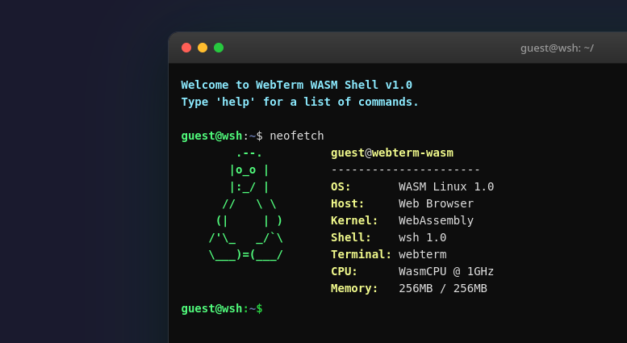
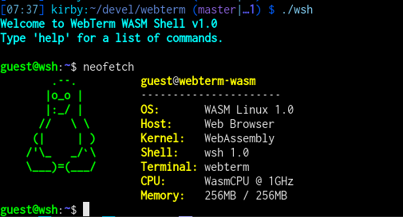

## Webterm

LLM generated example on how to compile and run a C program in a "terminal" in a web browser.

Fake "neofetch" executed from a web browser

Fake "neofetch" executed from a terminal

See my [blog post](https://gmelchett.github.io/2026-09-19/webterm.html) for more details.
